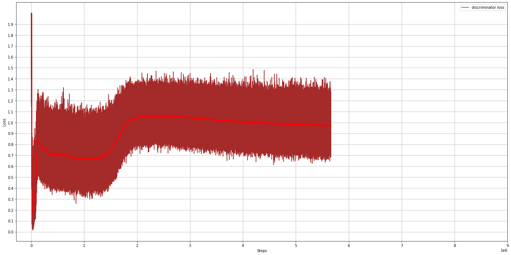

# ast
Implementation of Adversarial Sparse Transformer for Time Series Forecasting

https://proceedings.neurips.cc/paper/2020/file/c6b8c8d762da15fa8dbbdfb6baf9e260-Paper.pdf

Notes:

- Performance is just about 0.10 on gloss 50 metric on elect 1d dataset.
- I arranged layer normalization after each layer calculation and dropouts are just before layer. Otherwise, it does not work for me. It seems, layer should see/have those dropout zeros without them being leveled by layer normalization.
- I'm getting similar performance with 2 or 3 layers, 4 heads and 128 width. It is likely that changing width and number of heads, could improve prformance. it is just taking in a range of 500 epochs for me.
- I noticed that qloss training results in high error for some items. I think rmse error would pay more attention to outliers
- With adversarial Training I go 0.10 on q50 compare to 0.11 without it. It is just small difference 
- Prediction is done. Obviously, dataset should be continuation of the same time series! Probably, dataset should have TRAIN, VALIDATION, maybe TEST/PREDICT sets.
- I do not mask in decoder since there is no labels , it is not auto-regressive
- Discriminaror performance is like 0.85. It should be more confused I guess! 

To do/try:
- Sparse function is not implemented. Sparsemax function is available with Tensorfow 2 - tensorflow_addons. It may improve performance to make these zero weights
- I am seeing 0.05 q50 on training and 0.10 q50 on testing performance. I want to decrease such a difference making dropout higher tham 0.1
- I want to see performance with more hidden layer width and more heads

Commands:

Prepare datasets:

python prepare_data.py --lookback_history=168 --estimate_length=24 2>&1 | tee logs/prepare_data-168-24-stride-20220427

Train:

python training.py --action=TRAIN --output_dir=checkpoints --lookback_history=168 --estimate_length=24 --train_epochs=1000 --learning_rate=1e-4 --minimal_rate=1e-5 --decay_steps=50000 --warmup_steps=50000 --clip_gradients=-1.0 --hidden_size=128 --feedforward_size=128 --embedding_size=20 --discriminator_lambda=0.1 --num_attention_heads=4 --num_hidden_layers=2 --dropout_prob=0.1 --num_series=370 --training_set_size=321598 --train_file=data/train.tfrecords --test_file=data/test.tfrecords --predict_file=data/test.tfrecords --train_scaler_file=data/train_scaler.joblib --test_scaler_file=data/test_scaler.joblib --predict_scaler_file=data/test_scaler.joblib --batch_size=64

Generator loss

Discriminator loss

Discriminator accuracy

Evaluate:

python training.py --action=EVALUATE --output_dir=checkpoints --lookback_history=168 --estimate_length=24 --train_epochs=1000 --learning_rate=1e-4 --minimal_rate=1e-5 --decay_steps=50000 --warmup_steps=50000 --clip_gradients=-1.0 --hidden_size=128 --feedforward_size=128 --embedding_size=20 --discriminator_lambda=0.1 --num_attention_heads=4 --num_hidden_layers=2 --dropout_prob=0.1 --num_series=370 --training_set_size=321598 --train_file=data/train.tfrecords --test_file=data/test.tfrecords --predict_file=data/test.tfrecords --train_scaler_file=data/train_scaler.joblib --test_scaler_file=data/test_scaler.joblib --predict_scaler_file=data/test_scaler.joblib --batch_size=64; cat output.csv

Predict:

python training.py --action=PREDICT --output_dir=checkpoints --lookback_history=168 --estimate_length=24 --train_epochs=1000 --learning_rate=1e-4 --minimal_rate=1e-5 --decay_steps=50000 --warmup_steps=50000 --clip_gradients=-1.0 --hidden_size=128 --feedforward_size=128 --embedding_size=20 --discriminator_lambda=0.1 --num_attention_heads=4 --num_hidden_layers=2 --dropout_prob=0.1 --num_series=370 --training_set_size=321598 --train_file=data/train.tfrecords --test_file=data/test.tfrecords --predict_file=data/test.tfrecords --train_scaler_file=data/train_scaler.joblib --test_scaler_file=data/test_scaler.joblib --predict_scaler_file=data/test_scaler.joblib --batch_size=64; less output.csv

Peformance:

Adversarial with parameters as provided in samples:

q50 during trainig:

Final Testing set:

mae: 0.101003
mbe: -0.036529
mape: 25.351590
smape: 4.871360
mse: 0.046875
rmse: 0.216505
q50: 0.102923
